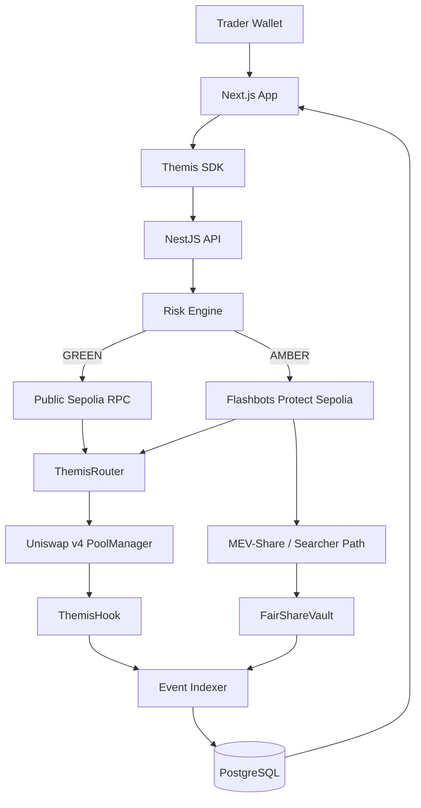

# Themis — PRD & Technical Requirements Document

**Version:** 1.0  
**Status:** Build-ready  
**Hackathon:** Atrium Academy UHI10 — Sustainable Liquidity & MEV Protection  
**Build window:** August 17 – September 3, 2026  
**Demo Day:** September 11, 2026  
**Network:** Ethereum Sepolia for the live MVP  
**Product name:** Themis  
**Core mechanism:** FairShare  
**Primary stack:** Solidity + Foundry, TypeScript, NestJS, Next.js, viem  
**Last updated:** August 15, 2026

---

# 1. Executive Summary

**Themis is an adaptive fair-flow layer for Uniswap v4 that keeps fees low in normal markets, routes MEV-sensitive swaps through protected order flow, and redirects part of captured backrun value to LPs through FairShare.**

The central UHI10 problem is that LPs in volatile pairs suffer value leakage from:

- sandwich attacks;
- toxic/informed order flow;
- loss-versus-rebalancing (LVR);
- predictable public-mempool ordering;
- arbitrage value that is captured by searchers instead of LPs.

Most existing approaches compensate LPs by raising swap fees, but higher fees make the pool less competitive for good flow.

Themis attacks the problem differently:

1. **Classify swap risk.**
2. **Keep low-risk swaps cheap and immediate.**
3. **Route MEV-sensitive swaps through Flashbots Protect.**
4. **Enable MEV-Share/backrun competition.**
5. **Split recaptured value between the trader and a FairShare LP vault.**
6. **Measure whether LPs can earn more while traders pay lower average costs.**

The product thesis is:

> Instead of making every trader pay higher fees to compensate LPs for MEV, make recaptured MEV help pay the LPs.

---

# 2. UHI10 Theme Alignment

UHI10 theme:

> **Sustainable Liquidity & MEV Protection**

Themis maps directly to the theme.

| UHI10 problem | Themis response |
|---|---|
| LPs lose to sandwich attacks | Flashbots Protect private submission for MEV-sensitive swaps |
| LPs lose LVR/arbitrage value | FairShare redirects part of backrun value to LPs |
| Dynamic fees cannot distinguish good/bad flow | Risk engine evaluates trade + market conditions instead of identity |
| Public ordering exposes transactions | Protected order-flow path |
| Private-orderflow systems sit outside Uniswap | Themis integrates Flashbots as a first-class routing path |
| Volatile pools need sustainable low fees | MEV-derived LP revenue supplements swap-fee revenue |

Themis deliberately does **not** position itself as another dynamic-fee hook, LVR auction, FHE dark pool, simple delay hook, or bot blacklist.

---

# 3. Product Vision

## 3.1 Vision

Turn a Uniswap v4 pool into an adaptive fair-flow liquidity venue where:

- ordinary users retain cheap, immediate execution;
- vulnerable trades avoid public-mempool exposure;
- searchers can still perform useful backruns;
- part of extractable value returns to the trader;
- part of extractable value becomes LP revenue;
- LP performance is measured against vanilla and higher-fee baselines.

## 3.2 One-line pitch

> **Themis keeps Uniswap cheap when markets are calm, protects flow when MEV risk rises, and turns captured MEV into LP revenue.**

## 3.3 Demo-Day pitch

> **Themis does not try to eliminate MEV. It changes who gets paid.**

---

# 4. Problem Statement

AMMs need arbitrage to remain aligned with external prices, but arbitrage and transaction ordering can transfer value away from LPs.

For volatile pairs, an LP may earn swap fees while simultaneously losing value through adverse selection and LVR.

The traditional response is:

```text
LP losses rise
     ↓
increase swap fee
     ↓
good flow becomes expensive
     ↓
volume migrates elsewhere
```

Themis targets a different loop:

```text
MEV risk rises
     ↓
protect transaction flow
     ↓
allow controlled backrun competition
     ↓
recapture part of backrun value
     ↓
trader rebate + LP FairShare
     ↓
lower dependence on high swap fees
```

---

# 5. Goals

## 5.1 MVP goals

The UHI10 MVP MUST demonstrate:

1. A functioning Uniswap v4 pool using `ThemisHook`.
2. A deterministic risk score for a proposed swap.
3. GREEN and AMBER execution modes.
4. Normal/public execution for GREEN swaps.
5. Flashbots Protect private submission for AMBER swaps on Sepolia.
6. A `FairShareVault` that can receive ETH.
7. Flashbots private-transaction configuration containing FairShare refund recipients.
8. A controlled MEV/searcher test path on Sepolia.
9. An analytics dashboard comparing:
   - vanilla v4;
   - a higher-fee baseline;
   - optional dynamic-fee baseline;
   - Themis.
10. Simulations reporting trader cost, LP PnL, LVR proxy, MEV leakage and MEV recapture.

## 5.2 Secondary goals

- Demonstrate automatic mode switching as volatility/impact rises.
- Record protected transaction status.
- Visualize FairShare revenue.
- Add deterministic tests for manipulation and threshold boundaries.
- Add RED mode only after the MVP is stable.

## 5.3 Non-goals for UHI10 MVP

The MVP will NOT attempt to:

- eliminate all MEV;
- detect whether an address is a bot;
- prove onchain that a transaction arrived via Flashbots;
- build a new block builder;
- build a new solver network;
- build a new MEV auction;
- create FHE/private execution infrastructure;
- replace CoW Protocol;
- implement a production-ready insurance DAO;
- create complex LP governance;
- guarantee an organic Sepolia MEV refund on every swap;
- support every ERC-20 edge case;
- support every EVM chain.

---

# 6. Users

## 6.1 Trader

A user swapping through Themis.

Needs:

- competitive execution;
- clear indication of protection mode;
- minimal extra UX;
- transparent MEV refund information;
- no requirement to understand Flashbots.

## 6.2 Liquidity Provider

A user providing liquidity to a Themis-enabled pool.

Needs:

- normal fee revenue;
- visibility into MEV recaptured by FairShare;
- evidence that Themis improves LP economics;
- transparent pool-level metrics.

## 6.3 Searcher

A participant looking for profitable backruns.

Needs:

- enough information to identify permitted backrun opportunities;
- standard Flashbots/MEV-Share interfaces;
- predictable settlement rules.

## 6.4 Pool Operator / Protocol

Needs:

- configurable risk thresholds;
- configurable FairShare percentages;
- observability;
- emergency controls;
- safe deployments.

---

# 7. Product Concepts

## 7.1 Risk regimes

### GREEN

Low MEV risk.

```text
Trader
  ↓
Themis SDK
  ↓
public RPC
  ↓
ThemisRouter
  ↓
Uniswap v4 PoolManager
  ↓
ThemisHook
```

Properties:

- immediate execution;
- low base fee;
- no special delay;
- normal Uniswap settlement.

### AMBER

Elevated MEV risk.

```text
Trader signs swap
       ↓
Themis SDK / API
       ↓
Flashbots Protect
       ↓
private inclusion
       ↓
ThemisRouter
       ↓
PoolManager
       ↓
ThemisHook
       ↓
MEV-Share/backrun opportunity
       ↓
refund split
   ↙              ↘
Trader        FairShareVault
```

Properties:

- transaction is not intentionally broadcast to the public mempool;
- private submission uses Flashbots;
- MEV-Share preferences are configured;
- refund recipients include the trader and FairShare vault;
- the pool keeps its low-fee design.

### RED — stretch goal

Extreme conditions.

Possible future mechanisms:

- short protected execution window;
- async settlement;
- time-weighted settlement;
- batch clearing;
- capped price impact;
- offchain solver competition.

RED is explicitly **not required for MVP**.

---

# 8. The FairShare Mechanism

FairShare is the value-redistribution component inside Themis.

## 8.1 Intended flow

```text
Protected Themis swap
        ↓
profitable backrun
        ↓
MEV-Share captures refundable value
        ↓
refund allocation
   ┌───────────────┐
   ↓               ↓
Trader        FairShareVault
```

Example experiment configuration:

```text
Trader:          60%
FairShareVault:  30%
Remainder:       available to builder/validator according to Flashbots mechanics
```

These percentages are experimental parameters and MUST be configurable.

## 8.2 Important constraint

FairShare is **not a protocol tax**.

It should represent a split of captured backrun value.

The UHI10 story is strongest when:

```text
LP revenue =
swap fees
+
recaptured MEV
```

rather than:

```text
LP revenue =
higher trader fees
```

## 8.3 MVP vault behavior

For the hackathon MVP, `FairShareVault` MUST:

- accept native ETH;
- attribute received revenue to a configured pool;
- expose cumulative captured revenue;
- emit deposit/accounting events;
- provide admin-configurable pool registration;
- support safe withdrawal to an approved recipient for test/demo purposes.

Production LP distribution is a post-MVP concern.

## 8.4 Post-MVP LP distribution

Potential options:

1. distribute according to time-weighted liquidity contribution;
2. use a single LP vault that owns the v4 position and issues shares;
3. snapshot position liquidity at accounting epochs;
4. integrate an external LP vault manager.

Do not add this complexity until the core FairShare pipeline works.

---

# 9. Risk Engine

## 9.1 Principle

Themis MUST classify **market state and trade characteristics**, not wallet identity.

Avoid:

```text
"this address is a bot"
```

Prefer:

```text
"this trade is likely to create harmful execution conditions"
```

## 9.2 MVP signals

The initial risk score SHOULD use:

- EWMA realized volatility;
- normalized trade size;
- expected price impact;
- current pool liquidity;
- recent flow intensity;
- optional pool/oracle divergence.

Proposed normalized model:

```text
risk =
  w_volatility       × volatilityScore
+ w_size             × tradeSizeScore
+ w_priceImpact      × priceImpactScore
+ w_flow             × flowIntensityScore
+ w_divergence       × oracleDivergenceScore
```

Each component is normalized to `[0, 100]`.

Final score is clamped to `[0, 100]`.

## 9.3 Initial weights

Start with:

```text
volatility:        30%
trade size:        25%
price impact:      30%
flow intensity:    15%
oracle divergence:  0% in MVP
```

This gives:

```text
risk =
0.30 * volatility
+ 0.25 * tradeSize
+ 0.30 * priceImpact
+ 0.15 * flowIntensity
```

Oracle divergence can be activated later.

## 9.4 Regime boundaries

Initial experimental thresholds:

```text
0–29     GREEN
30–69    AMBER
70–100   RED
```

For MVP:

```text
RED is treated as AMBER + "high risk" telemetry
```

until the RED execution mechanism is implemented.

## 9.5 EWMA volatility

Example:

```text
return_t = abs(price_t - price_t-1) / price_t-1

vol_t =
alpha * return_t
+ (1 - alpha) * vol_t-1
```

The alpha parameter MUST be configurable within safe bounds.

## 9.6 Hysteresis

To prevent constant GREEN/AMBER switching around a boundary:

```text
GREEN → AMBER threshold: 35
AMBER → GREEN threshold: 25
```

Exact values are simulation-driven.

## 9.7 Manipulation resistance

The risk model MUST be tested against:

- wash trades;
- repeated tiny swaps;
- swap splitting;
- threshold oscillation;
- one-block volatility spikes;
- manipulated external oracle inputs;
- multi-hop router behavior.

---

# 10. User Experience

## 10.1 Swap page

Display:

- selected token pair;
- amount;
- quote;
- estimated price impact;
- current Themis risk score;
- current regime;
- execution path;
- estimated swap fee.

Example:

```text
Risk score:       47 / 100
Mode:             AMBER
Execution:        Protected
Privacy provider: Flashbots Protect
FairShare:        Enabled
```

## 10.2 Transaction lifecycle

For protected transactions:

```text
1. Quote prepared
2. Risk evaluated
3. Transaction signed
4. Submitted privately
5. Awaiting inclusion
6. Included
7. Hook executed
8. Refund/FairShare status updated
```

## 10.3 LP dashboard

Display:

- TVL;
- swap fee revenue;
- FairShare revenue;
- total captured MEV;
- protected volume;
- public volume;
- GREEN/AMBER distribution;
- estimated LP PnL;
- comparison against vanilla baseline.

## 10.4 Research dashboard

Display experiment comparison:

| Metric | Vanilla v4 | High-fee v4 | Dynamic-fee baseline | Themis |
|---|---:|---:|---:|---:|
| LP net PnL | | | | |
| Fee revenue | | | | |
| LVR proxy | | | | |
| MEV leakage | | | | |
| MEV recaptured | | | | |
| Trader effective cost | | | | |
| Avg. slippage | | | | |
| Protected volume | | | | |

No numbers may be hard-coded as “results.”

---

# 11. Success Metrics

## 11.1 Product metrics

The MVP is successful if it can show:

- >0 private Themis swap included on Sepolia;
- `ThemisHook` executed during that swap;
- >0 ETH/test ETH received by `FairShareVault` in a controlled flow;
- risk-based route selection;
- measurable LP/trader metrics from simulations.

## 11.2 Research hypothesis

Primary hypothesis:

> A Themis pool can provide LPs with equal or better net revenue than a conventional higher-fee pool while charging lower average trader fees and reducing public-mempool MEV exposure.

## 11.3 Comparison metrics

Track:

### LP

- fee revenue;
- inventory value;
- mark-to-market PnL;
- LVR proxy;
- FairShare income;
- net return;
- revenue per unit of TVL.

### Trader

- fee paid;
- slippage;
- price impact;
- effective execution price;
- sandwich loss;
- MEV refund.

### Protocol

- volume by regime;
- private submission rate;
- failed private submissions;
- FairShare revenue;
- average risk score;
- mode transitions.

---

# 12. Functional Requirements

## FR-001 — Pool risk state

The system MUST maintain a per-pool risk state.

## FR-002 — Risk preview

The API/SDK MUST support a risk preview for a proposed trade.

## FR-003 — Risk validation

`ThemisHook` MUST recompute or validate the risk inputs it can independently verify.

## FR-004 — GREEN routing

GREEN transactions MUST support ordinary/public RPC submission.

## FR-005 — AMBER routing

AMBER transactions MUST support Flashbots Protect Sepolia submission.

## FR-006 — User signing

The backend MUST NOT hold the trader's private key.

The user's wallet signs the transaction.

## FR-007 — Flashbots request

Protected submission MUST support:

- raw signed transaction;
- max block number when appropriate;
- privacy hints;
- builders configuration when appropriate;
- refund recipient configuration.

## FR-008 — FairShare recipient

The Flashbots refund configuration SHOULD contain:

- the trader's refund address;
- `FairShareVault` address;
- configured percentages.

## FR-009 — Vault

`FairShareVault` MUST accept ETH and emit accounting events.

## FR-010 — Events

Contracts MUST emit events sufficient to power the demo dashboard.

## FR-011 — Transaction tracking

The backend MUST store:

- public/private route;
- transaction hash;
- submission timestamp;
- status;
- risk score;
- regime;
- pool ID;
- trader address;
- FairShare configuration.

## FR-012 — Metrics

The dashboard MUST distinguish real onchain data from simulated research data.

## FR-013 — Failover

If private submission fails before broadcast, the UI MUST NOT silently broadcast the same signed transaction publicly.

The user must explicitly choose a public fallback.

## FR-014 — No false provenance

The UI/backend MUST NOT claim that the hook itself verified Flashbots provenance.

## FR-015 — Configuration

Risk weights, thresholds and FairShare percentages MUST be centrally configured and versioned.

---

# 13. Non-Functional Requirements

## Security

- no private keys in backend;
- no secrets committed to git;
- explicit access control on configuration functions;
- reentrancy protection where required;
- safe ETH transfer patterns;
- hook permission bits verified during deployment;
- all critical accounting invariant-tested.

## Reliability

- private submission retries must be bounded;
- duplicate submission must be idempotent;
- backend must track pending/stuck private transactions;
- every external dependency requires timeout/error handling.

## Performance

- risk preview target: <500 ms excluding upstream RPC latency;
- swap UI should not block on analytics writes;
- contract risk updates must avoid unbounded loops.

## Observability

Structured logs MUST include:

```text
requestId
txHash
poolId
trader
riskScore
regime
submissionMode
flashbotsStatus
fairSharePercent
```

---

# 14. Technical Architecture

## 14.1 System diagram



## 14.2 Critical architectural truth

`ThemisHook` cannot know that a transaction came through Flashbots merely from EVM execution.

Therefore:

- **SDK/API** selects the submission path;
- **Flashbots** provides the private-orderflow path;
- **ThemisHook** independently owns pool risk/accounting state;
- **backend** records submission provenance;
- **demo** can validate Flashbots submission using transaction status APIs/logging.

Do not add a fake onchain boolean such as:

```solidity
bool cameFromFlashbots;
```

unless it is explicitly described as user-supplied metadata rather than cryptographic proof.

---

# 15. Repository Structure

```text
themis/
├── apps/
│   ├── web/                       # Next.js
│   └── api/                       # NestJS
│
├── contracts/
│   ├── src/
│   │   ├── ThemisHook.sol
│   │   ├── ThemisRouter.sol
│   │   └── FairShareVault.sol
│   ├── test/
│   │   ├── ThemisHook.t.sol
│   │   ├── RiskEngine.t.sol
│   │   ├── FairShareVault.t.sol
│   │   ├── ThemisIntegration.t.sol
│   │   ├── AdversarialFlow.t.sol
│   │   └── Invariants.t.sol
│   └── script/
│       ├── 00_DeployHook.s.sol
│       ├── 01_DeployVault.s.sol
│       ├── 02_DeployRouter.s.sol
│       ├── 03_CreatePool.s.sol
│       └── 04_AddLiquidity.s.sol
│
├── packages/
│   ├── sdk/
│   ├── config/
│   ├── types/
│   └── abis/
│
├── simulations/
│   ├── scenarios/
│   ├── searcher/
│   ├── analysis/
│   └── results/
│
├── infrastructure/
│   ├── docker/
│   └── compose.yaml
│
├── docs/
│   ├── ARCHITECTURE.md
│   ├── ECONOMICS.md
│   ├── THREAT_MODEL.md
│   ├── DEMO.md
│   └── DEPLOYMENT.md
│
├── .env.example
├── package.json
├── pnpm-workspace.yaml
└── README.md
```

---

# 16. Technology Stack

## Smart contracts

- Solidity
- Foundry stable
- Uniswap v4 core/periphery
- OpenZeppelin where appropriate

## Frontend

- Next.js
- TypeScript
- Tailwind CSS
- viem
- wagmi
- TanStack Query

## Backend

- NestJS
- TypeScript
- viem
- Prisma
- PostgreSQL
- structured JSON logging

## Tooling

- pnpm workspace
- Docker Compose
- GitHub Actions
- Foundry fuzz/invariant testing
- Vitest/Jest for TypeScript

---

# 17. Smart Contract Design

# 17.1 `ThemisHook.sol`

Primary responsibilities:

- hook into v4 swap lifecycle;
- maintain per-pool volatility/risk state;
- emit telemetry;
- optionally apply pool fee policy;
- verify hook data format;
- expose current pool risk state.

Suggested permissions for MVP:

- `beforeSwap`
- `afterSwap`

Only enable extra permissions when needed.

Pseudo-interface:

```solidity
interface IThemisHook {
    enum RiskRegime {
        GREEN,
        AMBER,
        RED
    }

    struct RiskState {
        uint32 riskScore;
        uint32 volatilityScore;
        uint32 flowScore;
        uint64 lastUpdated;
        RiskRegime regime;
    }

    function getRiskState(bytes32 poolId)
        external
        view
        returns (RiskState memory);

    function previewRisk(
        bytes32 poolId,
        bool zeroForOne,
        int256 amountSpecified
    )
        external
        view
        returns (uint32 riskScore, RiskRegime regime);
}
```

Events:

```solidity
event RiskUpdated(
    bytes32 indexed poolId,
    uint32 previousRisk,
    uint32 newRisk,
    uint8 regime
);

event ThemisSwapObserved(
    bytes32 indexed poolId,
    address indexed sender,
    int256 amountSpecified,
    uint32 riskScore,
    uint8 regime
);

event VolatilityUpdated(
    bytes32 indexed poolId,
    uint32 previousVolatility,
    uint32 newVolatility
);
```

## Security requirements

- never iterate over arbitrary trader lists;
- state changes must be O(1);
- use checked fixed-point math;
- cap risk parameters;
- test extreme ticks;
- test exact-input and exact-output swaps;
- test multi-hop behavior;
- verify hook address permission bitmap.

---

# 17.2 `FairShareVault.sol`

MVP responsibilities:

- receive native ETH;
- track cumulative value;
- optionally attribute revenue by pool ID;
- emit deposits;
- controlled admin withdrawal for test/demo;
- emergency pause if implemented.

Suggested interface:

```solidity
interface IFairShareVault {
    event FairShareReceived(
        bytes32 indexed poolId,
        address indexed sender,
        uint256 amount
    );

    function totalReceived() external view returns (uint256);

    function receivedForPool(bytes32 poolId)
        external
        view
        returns (uint256);

    function recordFairShare(bytes32 poolId)
        external
        payable;
}
```

The contract should also implement `receive()` if Flashbots sends native ETH directly without calldata.

If direct refunds cannot attach a pool ID, the backend/indexer can attribute them using:

- recipient;
- transaction hash;
- expected refund configuration;
- timestamp/block range.

Do not force pool attribution into the refund path if Flashbots does not provide calldata.

---

# 17.3 `ThemisRouter.sol`

Responsibilities:

- build a constrained swap path into the Themis pool;
- pass `hookData`;
- enforce deadline;
- enforce amount-out/minimum or amount-in/maximum;
- expose a predictable transaction target for Flashbots privacy hints.

MVP router should remain intentionally thin.

Do not reimplement Universal Router.

---

# 18. Hook Data

Proposed encoded `hookData`:

```solidity
struct ThemisHookData {
    address trader;
    uint32 quotedRisk;
    uint8 expectedRegime;
    bytes32 quoteId;
}
```

The hook MUST treat offchain fields as untrusted.

It may compare:

```text
quotedRisk vs independently computed risk
```

for telemetry, but MUST NOT assume the offchain quote is authoritative.

---

# 19. Backend Architecture

Suggested NestJS modules:

```text
src/
├── app.module.ts
├── risk/
│   ├── risk.module.ts
│   ├── risk.service.ts
│   └── risk.controller.ts
├── quotes/
│   ├── quotes.module.ts
│   └── quotes.service.ts
├── flashbots/
│   ├── flashbots.module.ts
│   ├── flashbots.service.ts
│   └── flashbots.types.ts
├── transactions/
│   ├── transactions.module.ts
│   ├── transactions.service.ts
│   └── transactions.controller.ts
├── pools/
├── metrics/
├── indexer/
└── config/
```

## 19.1 API responsibilities

The API:

- reads current onchain state;
- computes/returns route recommendation;
- accepts a **signed raw transaction** for protected submission;
- sends it to Flashbots;
- persists submission metadata;
- polls/updates transaction status;
- indexes Themis/FairShare events;
- exposes metrics.

The API MUST NOT:

- request user private keys;
- sign user swaps;
- silently downgrade protected transactions to public transactions.

---

# 20. API Endpoints

## `POST /v1/quote`

Request:

```json
{
  "poolId": "0x...",
  "tokenIn": "0x...",
  "tokenOut": "0x...",
  "amount": "1000000000000000000",
  "trader": "0x..."
}
```

Response:

```json
{
  "quoteId": "uuid",
  "riskScore": 47,
  "regime": "AMBER",
  "submissionMode": "PROTECTED",
  "priceImpactBps": 38,
  "fairShare": {
    "enabled": true,
    "traderPercent": 60,
    "lpPercent": 30
  }
}
```

## `POST /v1/transactions/private`

Request:

```json
{
  "quoteId": "uuid",
  "rawTransaction": "0x..."
}
```

Response:

```json
{
  "transactionHash": "0x...",
  "mode": "PROTECTED",
  "provider": "FLASHBOTS",
  "status": "SUBMITTED"
}
```

## `GET /v1/transactions/:hash`

Response:

```json
{
  "transactionHash": "0x...",
  "mode": "PROTECTED",
  "status": "INCLUDED",
  "blockNumber": 123,
  "riskScore": 47,
  "regime": "AMBER"
}
```

## `GET /v1/pools/:poolId/metrics`

Returns:

- TVL;
- volume;
- protected volume;
- public volume;
- FairShare total;
- risk state;
- regime distribution.

---

# 21. Flashbots Integration

## 21.1 Sepolia Protect RPC

Current documented Sepolia Protect endpoint:

```text
https://rpc-sepolia.flashbots.net/
```

## 21.2 Sepolia searcher relay

Current documented bundle relay:

```text
https://relay-sepolia.flashbots.net
```

## 21.3 Protected submission

Themis uses:

```text
eth_sendPrivateTransaction
```

with a raw signed user transaction.

Conceptual request:

```json
{
  "jsonrpc": "2.0",
  "id": 1,
  "method": "eth_sendPrivateTransaction",
  "params": [
    {
      "tx": "0xSIGNED_TRANSACTION",
      "maxBlockNumber": "0x...",
      "preferences": {
        "fast": false,
        "privacy": {
          "hints": [
            "contract_address",
            "function_selector",
            "hash"
          ],
          "builders": [
            "default"
          ]
        },
        "validity": {
          "refund": [
            {
              "address": "0xTRADER",
              "percent": 60
            },
            {
              "address": "0xFAIR_SHARE_VAULT",
              "percent": 30
            }
          ]
        }
      }
    }
  ]
}
```

The exact privacy hints used MUST be tested.

Do not expose more transaction information than necessary for the intended backrun market.

## 21.4 Priority fee

Flashbots Protect currently rejects transactions with zero priority fee.

The transaction builder MUST set a positive priority fee.

## 21.5 Refund semantics

Current Flashbots documentation states:

- refund recipients can be configured;
- multiple recipients can split backrun value by percentage;
- unspecified remainder is retained according to Flashbots builder/validator economics.

Themis MUST treat refund output as variable and non-guaranteed.

## 21.6 Testnet reality

Sepolia supports Flashbots Protect and the Flashbots searcher relay.

However:

> Organic searcher competition and meaningful organic MEV refunds are not guaranteed on a testnet.

Therefore the live demo MUST include a controlled searcher scenario.

---

# 22. Controlled Searcher / MEV Test Harness

Purpose:

- produce repeatable testnet/demo conditions;
- create a known backrun opportunity;
- verify private submission behavior;
- verify searcher/bundle handling;
- measure captured value.

Structure:

```text
Protected Themis swap
        ↓
controlled searcher observes/targets opportunity
        ↓
backrun transaction
        ↓
bundle/private execution path
        ↓
capture resulting PnL
        ↓
verify configured FairShare flow where available
```

Implementation options:

1. Flashbots bundle provider on Sepolia.
2. MEV-Share client/searcher tooling if Sepolia behavior supports the required flow.
3. Deterministic local mainnet-fork simulation for economics.
4. Sepolia protected transaction + controlled bundle as live proof.

The demo must clearly label:

- **real Sepolia transaction data**;
- **controlled searcher data**;
- **simulated economic results**.

Never present simulation output as organic mainnet behavior.

---

# 23. Database Schema

Suggested Prisma models.

```prisma
model Pool {
  id                String   @id
  token0            String
  token1            String
  hookAddress       String
  fairShareVault    String
  createdAt         DateTime @default(now())
  transactions      Transaction[]
  riskSnapshots     RiskSnapshot[]
}

model Transaction {
  id                String   @id @default(uuid())
  hash              String   @unique
  quoteId           String?
  poolId            String
  trader            String
  route             String
  provider          String?
  regime            String
  riskScore         Int
  fairSharePercent  Int?
  status            String
  blockNumber       BigInt?
  submittedAt       DateTime
  includedAt        DateTime?
  pool              Pool     @relation(fields: [poolId], references: [id])
}

model RiskSnapshot {
  id                String   @id @default(uuid())
  poolId            String
  riskScore         Int
  volatilityScore   Int
  priceImpactScore  Int
  flowScore         Int
  regime            String
  blockNumber       BigInt
  timestamp         DateTime
  pool              Pool     @relation(fields: [poolId], references: [id])
}

model FairShareReceipt {
  id                String   @id @default(uuid())
  txHash             String
  poolId             String?
  amountWei          String
  source             String
  blockNumber        BigInt?
  createdAt          DateTime @default(now())
}
```

---

# 24. Simulation Design

## 24.1 Baselines

At minimum:

### A. Vanilla low-fee v4 pool

Represents cheap execution with no Themis protection.

### B. Higher-fee v4 pool

Represents compensating LPs through higher fees.

### C. Themis

Low fee + protected flow + FairShare.

Optional:

### D. Dynamic-fee hook baseline

Useful if implementation time allows.

## 24.2 Shared scenario

Every candidate receives the same:

- initial liquidity;
- external/reference price path;
- trade sequence;
- trader sizes;
- arbitrage opportunities;
- volatility sequence.

## 24.3 Scenarios

### Scenario 1 — calm market

- low volatility;
- small retail swaps;
- minimal price jumps.

Expected:

- mostly GREEN;
- near-zero protection overhead.

### Scenario 2 — volatile market

- repeated external price jumps;
- medium/large swaps.

Expected:

- AMBER percentage increases.

### Scenario 3 — sandwichable trade

Simulate:

```text
attacker front-run
victim swap
attacker back-run
```

Compare trader loss in public path versus protected execution assumptions.

### Scenario 4 — informed/arbitrage flow

Model price movement immediately after trade.

Track LP markout/adverse selection.

### Scenario 5 — swap splitting attack

Large trader splits one risky trade into many smaller trades.

Measure whether the risk engine still increases protection due to flow intensity.

---

# 25. Core Simulation Metrics

Formulas should be documented in code.

## LP net value

```text
LP net value =
current LP inventory marked at reference price
+ fee revenue
+ FairShare revenue
```

## FairShare captured value

```text
FairShare revenue =
sum(all MEV-derived receipts attributed to pool)
```

## Effective trader cost

```text
effective trader cost =
swap fee
+ slippage
+ adverse MEV loss
- trader MEV refund
```

## Protection efficiency

```text
protection efficiency =
prevented or recaptured MEV
/
protection overhead
```

---

# 26. Security Threat Model

## 26.1 Hook risk

Threats:

- bad permission bits;
- reentrancy;
- incorrect `BeforeSwapDelta` use;
- transient accounting mistakes;
- overflow/precision loss;
- malformed `hookData`;
- multi-hop unexpected state transitions.

Mitigations:

- MVP avoids unnecessary custom deltas;
- mine/verify hook address permissions;
- use established v4 libraries;
- invariant testing;
- explicit bounds on all risk parameters.

## 26.2 Risk manipulation

Threats:

- tiny-trade spam;
- threshold gaming;
- volatility manipulation;
- quote/risk mismatch;
- stale state.

Mitigations:

- hysteresis;
- flow-intensity signal;
- capped per-block updates;
- compare quoted and onchain-computable state;
- expiry on quotes.

## 26.3 Private transaction leakage

Threats:

- accidental fallback to public RPC;
- RPC switching before confirmation;
- excess privacy hints;
- application logs containing raw signed transaction.

Mitigations:

- no automatic public fallback;
- never log raw signed transactions;
- explicit protected-status UI;
- minimal privacy hints;
- bounded transaction expiry.

## 26.4 Vault risks

Threats:

- unauthorized withdrawal;
- misattributed revenue;
- reentrancy;
- arbitrary token sends.

Mitigations:

- access control;
- pull-based withdrawal;
- event-based accounting;
- native ETH MVP only;
- test `receive()` path.

## 26.5 Backend threats

- replay of signed transaction;
- leaked secrets;
- request forgery;
- rate abuse.

Mitigations:

- transaction hash idempotency;
- signed quote IDs;
- rate limiting;
- strict CORS;
- secret management;
- never store private keys.

---

# 27. Testing Requirements

## Smart contracts

### Unit tests

`ThemisHook`

- default risk state;
- EWMA updates;
- GREEN boundary;
- AMBER boundary;
- hysteresis;
- exact input;
- exact output;
- zero/edge amounts;
- risk caps;
- multiple pools.

`FairShareVault`

- receive ETH;
- accounting;
- unauthorized withdrawal;
- zero value;
- multiple deposits;
- pause/emergency behavior if implemented.

### Fuzz tests

- amount ranges;
- tick ranges;
- repeated swaps;
- random volatility sequences;
- risk always remains within `[0, 100]`.

### Invariants

- risk score never exceeds bounds;
- FairShare accounting never exceeds received ETH;
- unauthorized callers cannot extract vault funds;
- hook does not leave PoolManager with invalid deltas;
- pool state remains internally consistent.

## Backend

- route selection;
- quote expiry;
- private submission request serialization;
- refund recipient math sums correctly;
- idempotency;
- no silent public fallback;
- Flashbots timeout/retry behavior.

## Frontend

- GREEN/AMBER display;
- wallet rejection;
- private submission status;
- no duplicate submit;
- error messages.

---

# 28. CI/CD

GitHub Actions SHOULD run:

```text
forge fmt --check
forge build
forge test
forge test --fuzz-runs <configured>
pnpm lint
pnpm typecheck
pnpm test
pnpm build
```

Deployment artifacts MUST include:

- contract address;
- chain ID;
- deployment tx;
- block number;
- hook permission bitmap;
- commit SHA.

---

# 29. Environment Variables

`.env.example`

```bash
# Network
SEPOLIA_RPC_URL=
SEPOLIA_CHAIN_ID=11155111

# Flashbots
FLASHBOTS_PROTECT_RPC=https://rpc-sepolia.flashbots.net/
FLASHBOTS_RELAY_URL=https://relay-sepolia.flashbots.net
FLASHBOTS_AUTH_PRIVATE_KEY=

# Contracts
THEMIS_HOOK_ADDRESS=
THEMIS_ROUTER_ADDRESS=
FAIR_SHARE_VAULT_ADDRESS=
POOL_ID=

# App
DATABASE_URL=
NEXT_PUBLIC_API_URL=
NEXT_PUBLIC_CHAIN_ID=11155111
```

`FLASHBOTS_AUTH_PRIVATE_KEY` is a backend/searcher authentication key where required.

It MUST NOT be the user's wallet key.

---

# 30. Deployment Strategy

## Local

1. Start Anvil.
2. Deploy PoolManager/test setup.
3. Mine Themis hook address permissions.
4. Deploy hook.
5. Deploy FairShare vault.
6. Deploy router.
7. Create pool.
8. Add liquidity.
9. execute simulations/tests.

## Sepolia

1. Fund deployment wallet with Sepolia ETH.
2. resolve current Uniswap v4 deployment addresses.
3. verify hook permission salt/address.
4. deploy `FairShareVault`.
5. deploy `ThemisHook`.
6. deploy `ThemisRouter`.
7. create Themis test pool.
8. seed test liquidity.
9. perform public GREEN swap.
10. perform private AMBER swap through Flashbots Protect.
11. validate onchain hook events.
12. run controlled searcher scenario.
13. record demo artifacts.

---

# 31. Hook Permission Address Mining

Uniswap v4 hook permissions are encoded into the hook address.

Deployment tooling MUST:

1. define exact permission bits;
2. derive/mines a CREATE2 salt;
3. verify resulting address;
4. deploy only if permissions match;
5. fail deployment if the bitmap is wrong.

For MVP do not enable callbacks that are not used.

---

# 32. Demo Plan

## Scene 1 — calm market

Swap a small amount.

Dashboard:

```text
Risk:       14
Regime:     GREEN
Route:      Public
FairShare:  Not required
```

Show:

- transaction;
- hook event;
- low fee.

## Scene 2 — volatility rises

Execute/simulate market movement.

Dashboard:

```text
Risk
14 → 26 → 43
```

Regime changes to AMBER.

## Scene 3 — protected swap

Submit a larger swap.

Show:

```text
Risk:       51
Regime:     AMBER
Route:      Flashbots Protect
FairShare:  Enabled
```

Show backend request metadata without exposing secrets/raw signed transaction.

## Scene 4 — FairShare

Show:

```text
Captured/controlled MEV value
         ↓
Trader allocation
+
FairShareVault allocation
```

Show onchain vault balance/event.

## Scene 5 — economics

Display comparison charts.

Primary visual:

```text
LP net return vs average trader cost
```

The audience should understand in seconds:

> Themis is trying to move the frontier: more sustainable LP revenue without making every trader pay a higher fee.

---

# 33. MVP Acceptance Criteria

The hackathon MVP is complete only when all P0 items are checked.

## P0

- [ ] `ThemisHook` compiles and passes tests.
- [ ] Hook permissions are correct.
- [ ] v4 pool created with Themis hook.
- [ ] liquidity added.
- [ ] GREEN swap succeeds.
- [ ] risk score changes deterministically.
- [ ] AMBER quote is generated.
- [ ] user signs AMBER swap.
- [ ] backend submits via Flashbots Sepolia.
- [ ] private transaction is included.
- [ ] hook executes for the private transaction.
- [ ] `FairShareVault` deployed and receives ETH in a controlled test.
- [ ] protected/public routes are visible in dashboard.
- [ ] baseline simulation runs.
- [ ] Themis simulation runs.
- [ ] comparison metrics are rendered.
- [ ] README explains architecture honestly.

## P1

- [ ] custom refund recipients included in private submission.
- [ ] controlled searcher bundle runs on Sepolia.
- [ ] private transaction status stored.
- [ ] LP dashboard shows FairShare revenue.
- [ ] adverse-flow/sandwich simulation.
- [ ] swap-splitting adversarial test.

## P2

- [ ] RED mode.
- [ ] AsyncSwap.
- [ ] external oracle divergence.
- [ ] LP reward claims.
- [ ] governance.
- [ ] multiple protected-orderflow providers.

---

# 34. Build Order

## Phase 0 — Architecture and scaffolding

- monorepo;
- Foundry template;
- Next.js;
- NestJS;
- shared TypeScript config;
- CI.

## Phase 1 — Core hook

Build:

```text
ThemisHook
risk state
EWMA volatility
risk preview
events
tests
```

Do not build UI polish yet.

## Phase 2 — Pool integration

- deploy hook locally;
- create v4 pool;
- add liquidity;
- execute swap;
- verify events.

## Phase 3 — Flashbots proof

Before advanced economics:

- build raw signed transaction flow;
- submit protected transaction on Sepolia;
- verify inclusion;
- confirm Themis hook execution.

This de-risks the external dependency early.

## Phase 4 — FairShare

- deploy vault;
- configure refund request;
- controlled value receipt;
- event/indexing.

## Phase 5 — Simulation

- baseline;
- Themis;
- volatility scenarios;
- adverse flow;
- charts.

## Phase 6 — Product UI

Build only the pages required for the demo:

```text
/swap
/pool
/research
```

## Phase 7 — Hardening

- fuzz;
- invariants;
- threat model;
- failure UX;
- docs;
- demo script.

---

# 35. Suggested Hackathon Schedule

## Aug 17–19

- repository setup;
- v4 template;
- `ThemisHook`;
- risk engine;
- core tests.

## Aug 20–21

- local pool deployment;
- `ThemisRouter`;
- hook integration.

## Aug 22–24

- Sepolia deployment;
- Flashbots private submission POC;
- transaction tracking.

## Aug 25–26

- `FairShareVault`;
- refund configuration;
- controlled searcher/bundle path.

## Aug 27–29

- simulation harness;
- adversarial scenarios;
- economic metrics.

## Aug 30–31

- Next.js dashboard;
- API integration;
- charts.

## Sep 1

- security/invariant pass;
- failure-path testing.

## Sep 2

- demo rehearsal;
- README;
- architecture diagrams;
- clean deployment.

## Sep 3

- final submission;
- backup demo data;
- tagged release.

---

# 36. Demo Failure Strategy

Never depend on live third-party behavior without a fallback.

Prepare:

1. real Sepolia deployment;
2. previously successful Flashbots tx hashes;
3. recorded FairShare events;
4. deterministic local simulation;
5. controlled test searcher;
6. cached experiment results generated from committed scripts.

If live Flashbots inclusion is slow during Demo Day, show the already-confirmed real Sepolia transaction and run the deterministic simulation live.

Do not fabricate a refund.

---

# 37. Open Questions to Resolve During Build

These are design questions, not blockers.

1. Which privacy hints maximize backrun competition without revealing unnecessary information?
2. What FairShare split gives the best trader/LP incentive balance?
3. Should volatility be entirely pool-derived for MVP?
4. Is an external oracle worth the trust/staleness complexity?
5. What risk threshold produces meaningful protection without over-routing?
6. Can Sepolia MEV-Share reliably demonstrate automatic refunds, or should live proof focus on private inclusion + controlled bundle/value transfer?
7. Should `FairShareVault` eventually become the LP position owner?
8. Should RED become AsyncSwap or batch settlement?

---

# 38. Explicit Design Decisions

## Decision 1

**Do not classify wallets as good/bad.**

Reason: trivial Sybil resistance failure.

## Decision 2

**Do not make BOND/searcher collateral the flagship mechanism.**

Reason: adjacent bonded-searcher/slashing mechanisms already exist.

## Decision 3

**Do not randomize trader fill prices as the primary defense.**

Reason: adjacent probabilistic-settlement designs already exist and randomness complicates trader UX.

## Decision 4

**Use Flashbots as a real integration, not a marketing label.**

Themis will actually submit signed Sepolia transactions through Flashbots Protect.

## Decision 5

**The hook does not claim to prove private provenance.**

Submission provenance belongs to the routing layer.

## Decision 6

**RED is a stretch goal.**

GREEN + AMBER + FairShare + rigorous simulation is enough for a strong MVP.

## Decision 7

**Research metrics are part of the product.**

Themis must prove its economic claim rather than only demonstrate successful swaps.

---

# 39. Future Architecture

After UHI10:

```text
Themis
├── public route
├── Flashbots route
├── CoW route
├── builder-attested route
└── protected batch route
```

Possible future features:

- multi-provider protected orderflow;
- CoW intent matching before AMM fallback;
- LP-owned FairShare vault shares;
- external fair-price oracle;
- markout-based risk calibration;
- adaptive protected execution windows;
- per-pool policy governance;
- Unichain-specific builder integrations;
- production monitoring and circuit breakers.

---

# 40. Source References

The build should use current primary documentation as the source of truth.

## Flashbots

Flashbots Protect quick start:

https://docs.flashbots.net/flashbots-protect/quick-start

Flashbots JSON-RPC endpoints / `eth_sendPrivateTransaction`:

https://docs.flashbots.net/flashbots-auction/advanced/rpc-endpoint

Flashbots Sepolia testnet/searcher relay:

https://docs.flashbots.net/flashbots-auction/advanced/testnets

Flashbots Protect MEV refunds:

https://docs.flashbots.net/flashbots-protect/mev-refunds

Flashbots Protect settings:

https://docs.flashbots.net/flashbots-protect/settings-guide

## Uniswap v4

Official v4 hook template:

https://github.com/Uniswap/v4-template

Uniswap v4 core:

https://github.com/Uniswap/v4-core

Uniswap Foundation hook security framework:

https://github.com/uniswapfoundation/security-framework

Uniswap v4 docs:

https://docs.uniswap.org/contracts/v4/overview

---

# 41. Definition of Done

Themis is not done because:

```text
the hook compiles
```

The UHI10 build is done when we can prove this entire path:

```text
market/trade risk
      ↓
Themis selects protected mode
      ↓
user signs swap
      ↓
Flashbots Sepolia private submission
      ↓
Uniswap v4 executes Themis pool swap
      ↓
ThemisHook records risk
      ↓
searcher/backrun path creates recoverable value
      ↓
FairShareVault receives LP-directed value
      ↓
dashboard measures the result
      ↓
simulation compares Themis against baselines
```

The final question the demo must answer is:

> **Can Themis keep a volatile Uniswap pool competitive at low fees while reducing MEV exposure and giving LPs a new source of revenue?**

Everything that does not help answer that question is secondary.
